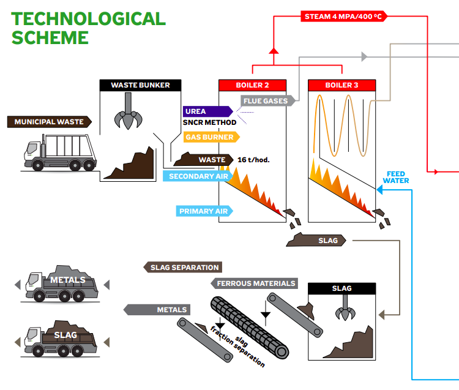
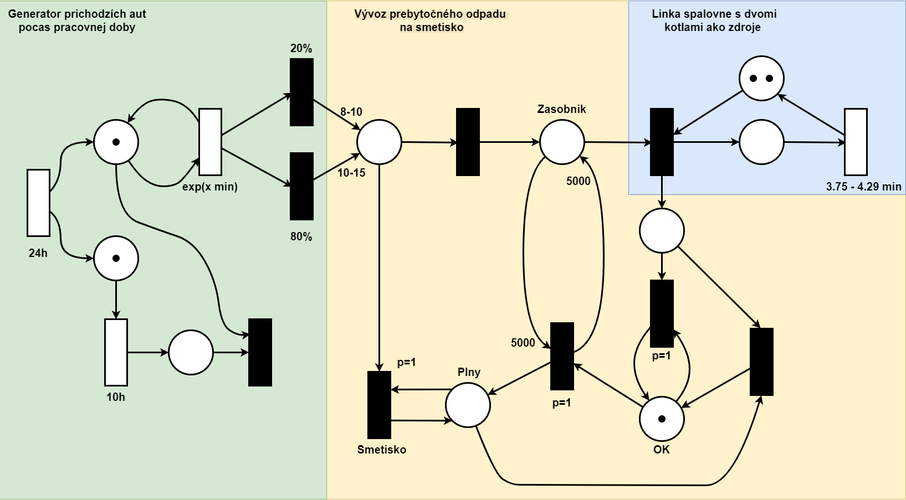
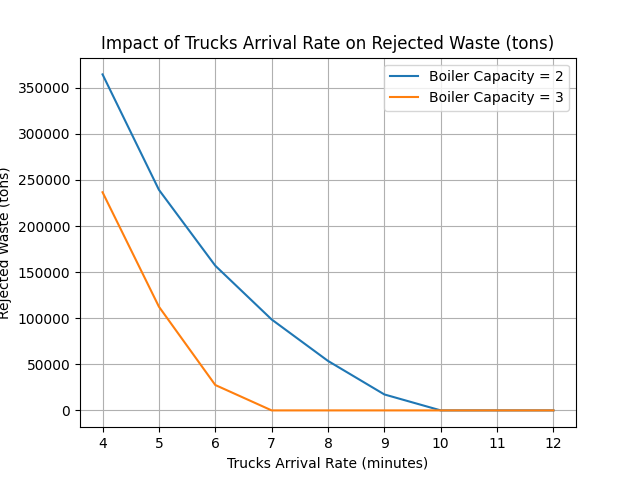
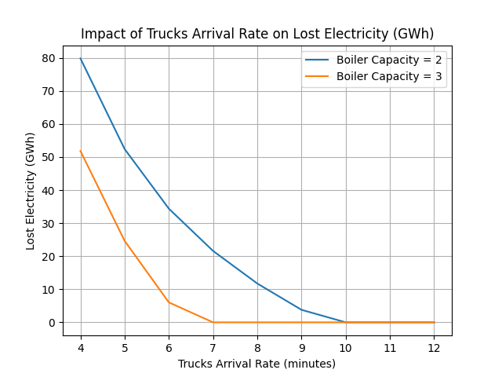
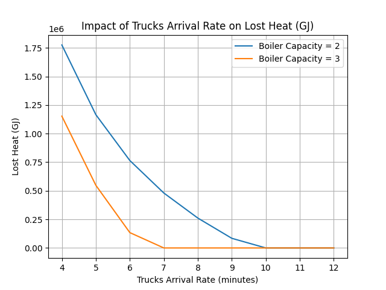

# IMS Projekt - T7: Ekologie a odpadové hospodářství


**Model systému hromadnej obsluhy (SHO) nakladania s odpadom v spaľovni**  

**Dátum**: 2.12.2024

**Autori**:

- Adam Havlík (**xhavli59**)
- Martin Knor (**xknorm00**)

<!-- markdownlint-disable MD033 -->
<div style="page-break-after: always;"></div>
<!-- markdownlint-enable MD033 -->

## Obsah

- [1 Úvod](#1-úvod)
  - [1.1 Autori a zdroje](#11-autori-a-zdroje)
  - [1.2 Overenie validity modelu](#12-overenie-validity-modelu)
- [2 Rozbor témy, použitých metód a technológii](#2-rozbor-témy-použitých-metód-a-technológii)
  - [Schéma spaľovne](#schéma-spaľovne)
  - [2.1 Popis použitých postupov](#21-popis-použitých-postupov)
  - [2.2 Popis pôvodu použitých metód](#22-popis-pôvodu-použitých-metód)
- [3 Koncepcia modelu](#3-koncepcia-modelu)
  - [3.1 Vyjadrenie konceptuálneho modelu](#31-vyjadrenie-konceptuálneho-modelu)
  - [3.2 Formy konceptuálneho modelu](#32-formy-konceptuálneho-modelu)
- [4 Koncepcia inplementácie](#4-koncepcia-inplementácie)
  - [4.1 Algoritmus udalosti príjazdu smetiarskeho auta](#41-algoritmus-udalosti-príjazdu-smetiarskeho-auta)
  - [4.2 Algoritmus procesu chovania odpadu](#42-algoritmus-procesu-chovania-odpadu)
- [5 Architektura simulačního modelu](#5-architektúra-simulačného-modelu)
- [6 Podstata simulačných experimentov a ich priebeh](#6-podstata-simulačných-experimentov-a-ich-priebeh)
- [6 Záver](#6-záver)
- [7 Literatúra](#7-literatúra)

<!-- markdownlint-disable MD033 -->
<div style="page-break-after: always;"></div>
<!-- markdownlint-enable MD033 -->

## 1 Úvod

V tejto práci je zostavený model [1, slide 7] nakladania s komunálnym odpadom v Zariadení pre Energetické Využitie Odpadu - ZEVO, SAKO Brno a jeho simulácia [1, slide 33] po dobu jedného roku. Cieľom simulácie je zistiť koľko ton odpadu bude musieť byt z kapacitných dôvodov vyvezeného na smetisko bez jeho ďaľšieho spracovania. Vďaka tomuto modelu a vykonaným simuláciám [1, slide 9] je možné pozorovať vplyv narastajúceho záujmu o ekologickú likvidáciu odpadu a jeho energetického zhodnotenia na množstvo vyvezeného odpadu na smetisko. Zmyslom experimentovania [1, slide 10] je zistit slabé miesta tohoto modelu. V súčastnej dobe sú investície veľmi skúmané a posudzované najma z ekonomického hladiska. V budúcnosti bude pre súčastnú legislatívu nutné urobiť kroky k redukcií zvyšujúcej sa hmotnosti vyprodukovaného odpadu a jeho následnej likvidácií. Cena tretieho kotla je príliš vysoká a odhaduje sa na 2,5 miliardy korun a tak je otázne či v budúcnpsti príde takáto investícia.

### 1.1 Autori a zdroje

Autormi tohoto projektu sú Adam Havlík a Martin Knor z Fakulty Informačních Technologií VUT v Brne.

Za využitia poznatkov z predmetu Modelovanie a simulácie [[1]](#7-literatúra), Odpady v krajoch s Petrom Havelkom [[3]](#7-literatúra), Výročná správa konsolidovaného celku SAKO Brno [[4]](#7-literatúra), Spalovna odpadov v Brne [[5]](#7-literatúra). Problematika bola telefonicky diskutovaná so zamestnancami spalovne a SAKO Brno ako aj s dvomi posádkami smetiarskych áut rôznych spoločnosťí pracujúcich v odpadovom hospodárstve na území mesta Brna.

### 1.2 Overenie validity modelu

Overenie validity [1, slide 37] modelu prebiehalo analýzou verejne dostupných dát, osobnými rozhovormi s pracovníkmi v odpadovom hospodárstve konfrontovanými s výstupmi s našej simulácie.

<!-- markdownlint-disable MD033 -->
<div style="page-break-after: always;"></div>
<!-- markdownlint-enable MD033 -->

## 2 Rozbor témy, použitých metód a technológii

V Juhomoravskom kraji sa ročne vyprodukuje približne 658 262 ton zmišaného komunálneho odpadu. Odpad je do spalovne dovážaný priamo smetiarskymi autami z Brna a okolia. Smetiarske auto v závislosti od konfigurácie a prepravovaného materiálu dokáže odviesť 8 až 15 ton materiálu. S pravdepodobnostou 20% je auto naložené nákladom 8 až 10 ton, s 80% pravdepodobnosťou majú 10 až 15 ton. Autá prichádzajú počas smeny smetiarov s exponenciálnym rozložením 8 minút. Smena smetiara trvá približne 10 hodín. Po príchode auto vysype odpad do zásobníku s kapacitou 5000 ton. Zariadenie pre energetické využitie odpadu ZEVO - SAKO Brno, disponuje dvoma kotlami kde sa pri teplote okolo 850°C spaľuje zmiešaný komunálny odpad. Jeden kotol dokáže spracovať 14 až 16 ton odpadu za hodinu. Pri plnom zatažení dokáže spaľovna spracovať 248 000 ton ročne. Objem spracovaného odpadu redukuje o 90% a hmotnost znižuje takmer na štvrtinu pôvodnej hodnoty čo predstavuje 10 násobné predĺženie životnosti skládky. Výsledkom tohoto procesu je škvára ktorá sa daľej separuje od kovov ktoré sú určené k ďaľšej recyklácií. Zbytok škváry s minimálnym organickým a využiteľným zvýškom sa používa na ďalšie zabezpečenie skládky.

Celý proces je znázornený na nasledujúcom obrázku:

### Schéma spaľovne



Obrázok 1: Schéma spaľovne

### 2.1 Popis použitých postupov

K vytvoreniu modelu spaľovne bol použitý programovací jazyk C++ pre jeho vysokú mieru abstrakcie a výpočtového výkonu. Taktiež kompatibilita s knižnicou SIMLIB napísanou tiež v C++ predstavenou na prednáškach ktorá poskytuje dostatočné pokrytie požiadaviek našeho modelu pri zachovaní Clean Code metodologie.

### 2.2 Popis pôvodu použitých metód

Symulačný model [1, slide 44] je inplementovaný v jazyku C++, štandarde C++11. Knižnica SIMLIB vo verzii 3.09 [[2]](#7-literatúra). O jednoduché spustenie sa stará program GNU Make.

<!-- markdownlint-disable MD033 -->
<div style="page-break-after: always;"></div>
<!-- markdownlint-enable MD033 -->

## 3 Koncepcia modelu

Návrh konceptuálneho modelu [4, slide 48] reprezentuje systém hromadnej obsluhy (SHO) vychádzajúci z rozboru témy popísanej v kapitole 2.

Zanedbanie odstávky spaľovne na servisné úkony. Keďže odstavenie kotla je časovo a finančne náročné v našej simulácií simulujeme nepretržitú prevádzku po celý rok. To nám vo výsledku vygeneruje niečo viac ako 260 000 ton spracovaného odpadu ročne čo je len o 12 000 viac ako tvrdia oficiálne zdroje. Taktiež sú spomenuté dve odstávky na jar a na jeseň avšak nešpecifikujú dlžku odstávok. Vzhľadom na to, že rozdiel je pri takom veľkom objeme celkového odpadu minimálny nebudeme zavádzať do nášho modelu umelé odstávky spaľovne. Ak uvážime plný výkon oboch kotlov a dve odstávky, každú na týždeň tak môže byť strata 16x2x24x2x7 = 10752 čo sa približuje nami nasimulovanej hodnote.

Dôraz bol kladený na konzistentnosť dát získaných z rôznych zdrojov potrebných pre dosiahnutie reálnejších výstupov simulácie ako aj obecné zoznámenie sa s prolematikov odpadového manažmentu v Juhomoravskom kraji.

### 3.1 Vyjadrenie konceptuálneho modelu

Model spaľovne je vizualizovaný pomocou petriho siete



Obrázok 2: Petriho sieť spaľovne ZEVO - SAKO Brno

### 3.2 Formy konceptuálneho modelu

Koncept modelu bol vytvorený za pomoci petriho siete navrhnutej v kapitole 3.1

<!-- markdownlint-disable MD033 -->
<div style="page-break-after: always;"></div>
<!-- markdownlint-enable MD033 -->

## 4 Koncepcia inplementácie

Hlavnými prvkam programu sú udalosti príjazdu daľšieho smetiarskeho auta generujúceho proces odpadu. Ich chovanie je algoritmicky popísané nasledovne

### 4.1 Algoritmus udalosti príjazdu smetiarskeho auta

```c
if (Je pracovná doba) {
    náhodnáPravdepodobnosť
    if ( náhodnáPravdepodobnosť < 0.2 ) {
        dovezeýOdpad = Náhodná(8, 10)
    } else {
        dovezeýOdpad = Náhodná(10, 16)
    }
            
    for ( Počet odpadov ) {
        Vytvor nový odpad
    }
    príchodDalšiehoAuta = Time + Exponential(8 * MIN)

} else {
    príchodDalšiehoAuta = Daľší deň
}

Opakuj udalosť(príchodDalšiehoAuta);
```

### 4.2 Algoritmus procesu chovania odpadu

```c
if ( Kotle sú plné ) {
        if ( Zásobník nieje plný ) {
            Odpad je uložený do zásobníku
            Proces odpadu je uspatý a čaká na aktiváciu
        } else {
            Odpad je vyhodený na skládku
            Proces odpadu končí
        }
    }

Alokuj kotol
Čakaj HOUR/Náhodná(14, 16)
Uvoľni kotol

if ( Zásobník nieje prázdny ) {
    Aktivuj ďalší odpad
}
```

<!-- markdownlint-disable MD033 -->
<div style="page-break-after: always;"></div>
<!-- markdownlint-enable MD033 -->

## 5 Architektúra simulačného modelu

## 6 Podstata simulačných experimentov a ich priebeh

### Postup experimentácie

Jednotka modelov´eho ˇcasu [4, slide 21] odpov´ıd´a minutˇe re´aln´eho ˇcasu.[4, slide 21]

Experiment sa spúšťa pomocou príkazu `make` nasledovaného `make run`. Pri spustení je možné zadať časový interval príchodu smetiarskych aut do spalovne a pocet kotlov s ktorym spalovna operuje. Pre naše úcely nás zaujíma interval príchodov od 4-12 minut a sucasny operacny pocet kotlov a hypoteticky scenar s troma kot. Výsledky experimentu sú následne uložené do súboru `results.out`.



Obrázok 3: Graf zobrazujúci nezhodnotený odpad v tonách



Obrázok 4: Graf zobrazujúci potencionálne teplo z nevyužiteho odpadu(GJ)



Obrázok 5: Graf zobrazujúci potencionálnu elektrickú energiu z nevyužiteho odpadu(GWh)

<!-- markdownlint-disable MD033 -->
<div style="page-break-after: always;"></div>
<!-- markdownlint-enable MD033 -->

## 6 Záver

<!-- markdownlint-disable MD033 -->
<div style="page-break-after: always;"></div>
<!-- markdownlint-enable MD033 -->

## 7 Literatúra

[1] Peringer P., Hrubý M. _Modelování a simulace_ September 2024. [cited 2.12.2024] available at: <http://perchta.fit.vutbr.cz/vyuka-ims/uploads/1/IMS.pdf>

[2] Peringer P. _SIMulation LIBrary for C++_ Október 2021 available at: <https://www.fit.vut.cz/person/peringer/public/SIMLIB/>

[3] Havelka P. _Rubrika Odpady v krajoch s Petrom Havelkom - Juhomoravský kraj_ Február 2024. [cited 2.12.2024] available at: <https://www.caoh.cz/aktuality/rubrika-odpady-v-krajich-s-petrem-havelkou-jihomoravsky-kraj.html>

[4] BDO Audit, _Výročná správa konsolidovaného celku_ Apríl 2024. [cited 2.12.2024] available at: <https://www.sako.cz/sites/default/files/docs/2024/07/sako_vz2023.pdf>

[5] SAKO Brno, _Spalovna odpadov v Brne_ [cited 2.12.2024] available at: <https://www.sako.cz/sites/default/files/docs/2024/05/sako_brozura%20spalovna_210x210_15_en.pdf>
